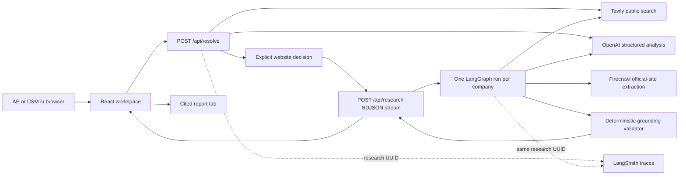
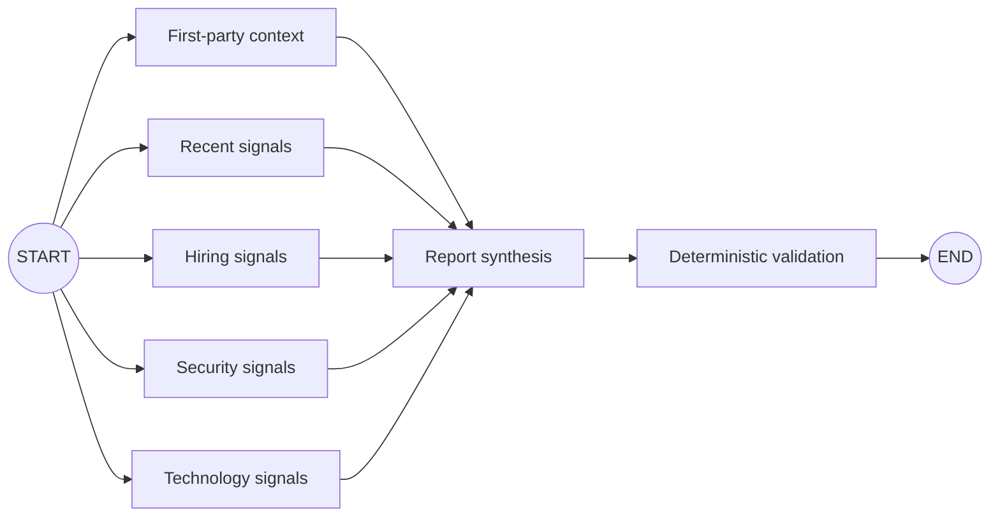

# Architecture map

## System shape

The application is one Next.js App Router project. The browser owns interaction and presentation. Server route handlers own credentials, provider calls, model calls, graph execution, and validation.



## Per-company research graph



The five specialist nodes execute in parallel. Each writes to a separate state key. Synthesis starts only after all five have completed or returned an honest gap. Validation is ordinary TypeScript code, not another model call.

## Important boundaries

### Discovery is not authorization

`/api/resolve` proposes up to four official-site candidates. Even a single strong candidate remains paused until the user selects it, enters a website manually, or discards the row. This prevents a name-resolution guess from silently spending credits or researching the wrong entity.

### Providers do not define the internal data model

Tavily and Firecrawl responses are parsed and reduced to two records:

```text
Source: title, public URL, publisher, type, optional date
Evidence: immutable excerpt, source ID, collection time
```

Prompts receive only those normalized records. Raw provider payloads do not reach the browser.

### Models select and author; code enforces

Specialist model calls select existing evidence IDs. The synthesis model writes report content using only retained evidence. Deterministic code then checks:

- claim -> evidence -> source integrity;
- unique canonical source URLs and evidence excerpts;
- complete citation coverage and removal of unused lineage;
- specific item-level hiring, news, security, and technology evidence;
- one strongest source per hiring role and named technology;
- duplicate job, event, and technology rejection;
- explicit gaps when optional findings must be omitted.

Code may omit unsafe optional material, but it never repairs a claim or creates a substitute finding.

### Credentials stay server-side

The browser calls only `/api/resolve` and `/api/research`. All provider headers and model configuration are created in server modules. No required environment variable uses `NEXT_PUBLIC_`.

## Observability

Every company receives a UUID before resolution. The same value appears in resolution state, user selection, graph state, streamed progress, report output, LangGraph `thread_id`, LangSmith metadata, and the `research:<uuid>` tag. Identity normalization has its own trace but uses the same correlation value.

The UI progress view is transient. Detailed diagnostics belong in LangSmith; the application intentionally does not maintain its own provider/model run log.
